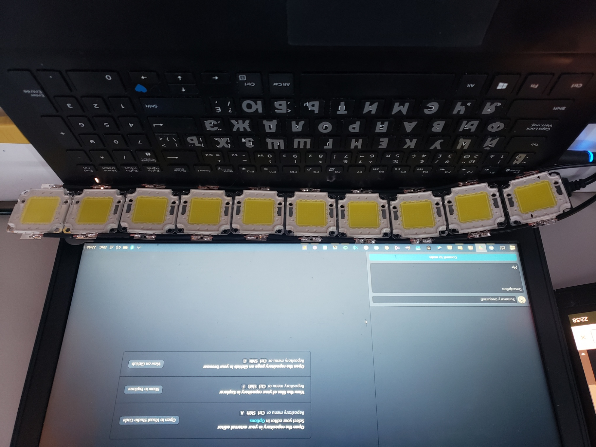
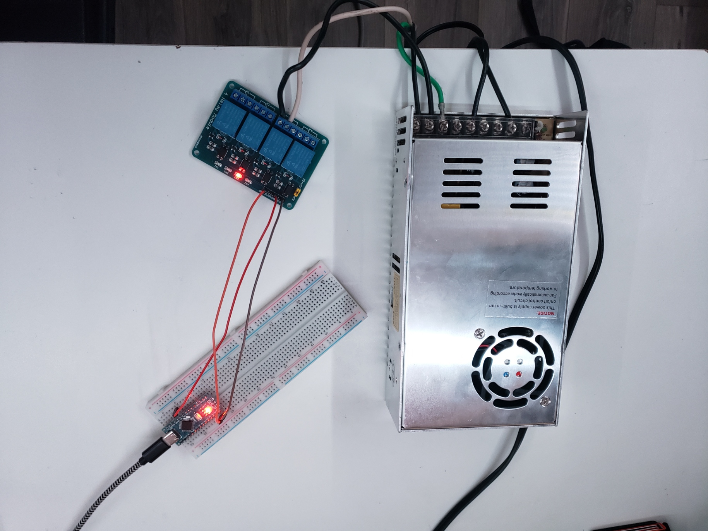

# enhanced-flashbangs 

Have you ever thought that the flashbangs in Counter Strike: Global Offensive arn't realistic enough?

If so, this is the project for you! All you need is a 1000 watt power supply, and a little bit of soldering skill. 

## Usage

Run main.py and open CS:GO on your main monitor. 
Plug Arduino into usb port. And upload Arduino code. You may need to change COM to the usb port in comms.py

### Materials

- Power supply

- 100 watt LEDs

- Arduino board

- 120v Relay

----

This project was made in a few hours just to have some fun