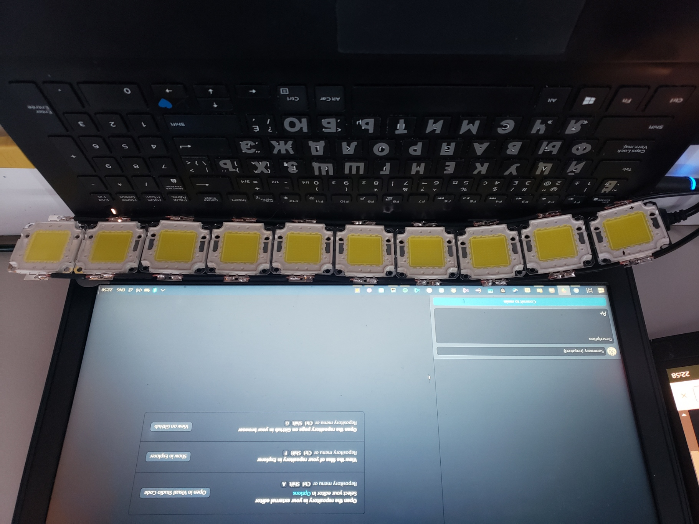
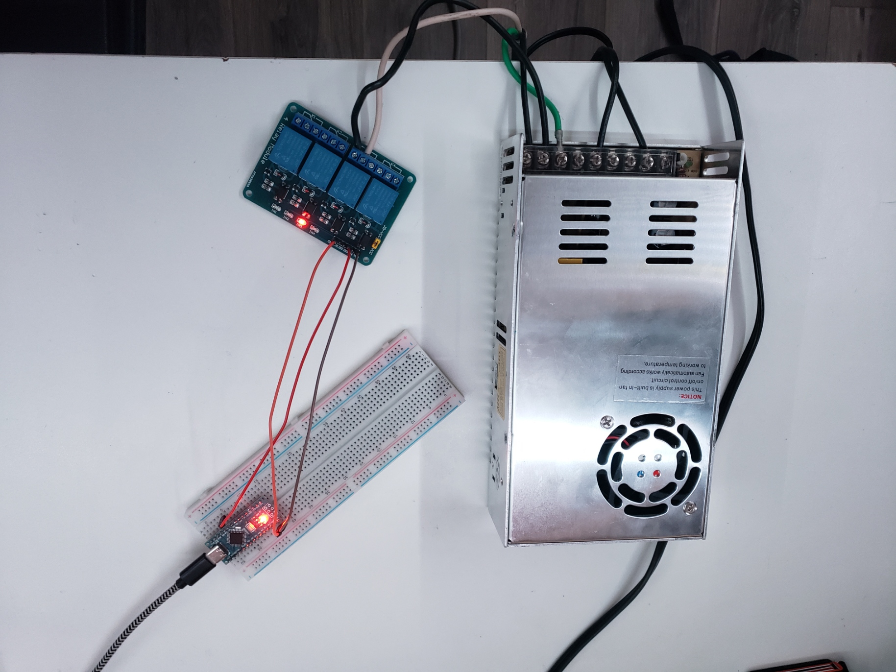
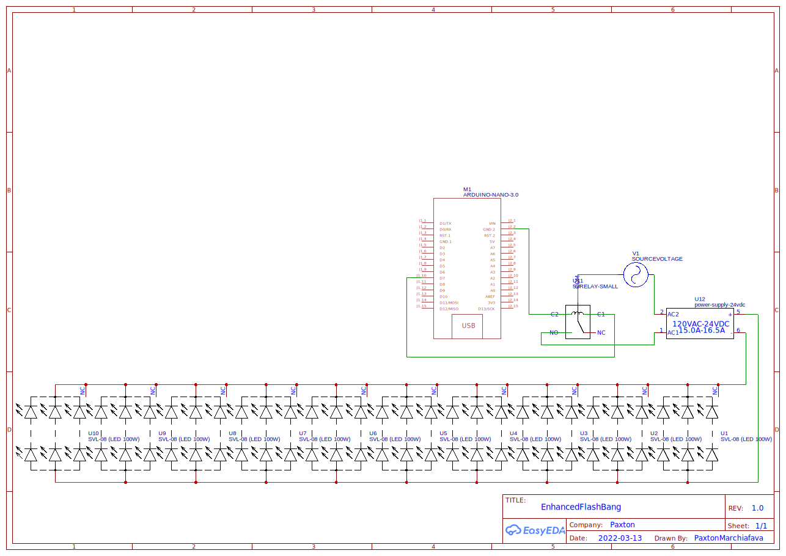

# Enhanced Flashbangs

Enhanced Flashbangs adds an extra dimension to PC games (Counter Strike in our case) that use blinding flashbangs. The software and hardware combine
to enable the ultra-bright series of lights placed at the bottom of the computer monitor to become enabled whenever an 
in-game flashbang has been used on your player character.

Here's a sample video of the device being used:

## Building your own

The following device is relatively simple and can be assembled in an afternoon. Here is some helpful information for doing so.

### Materials

The following materials were used in this project:

- 24V PSU, 1000W
- Arduino Nano
- [100 Watt LEDs](https://www.aliexpress.com/item/32980694428.html?spm=a2g0o.order_list.0.0.21ef1802r6l3Vy)
- [4-channel 5V Relay](https://www.aliexpress.com/item/32274260444.html?spm=a2g0o.order_list.0.0.21ef7385fMxzqL)

### Hardware + Schematic

### Using the Code

* Run `main.py` and open Counter Strike on your main monitor
* Plug in your Arduino and upload the `firmware.ino` file to it
* Modify the `arduino.port` variable in `comms.py` to match the port of your Arduino

